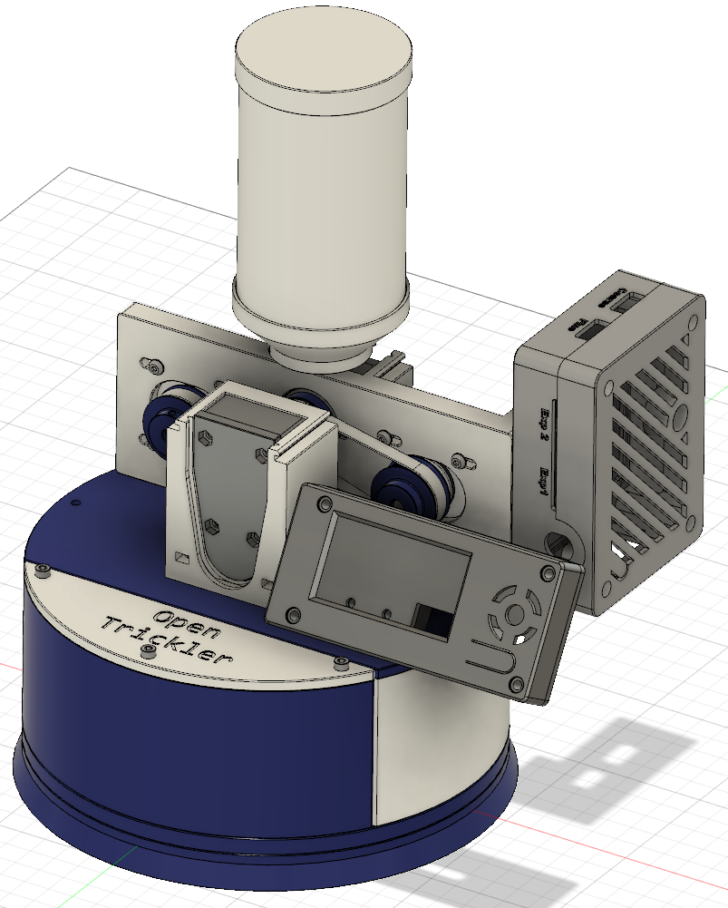

# @dirtbit contribution

* Display Assy + required Trickler Adapter Plate
* Pico Expansion Board enclosure + required OpenTrickler_RearBody
* Volume Reduction Inserts for easy cleaning

You need a handful of M3x 10 / 12 / 16 / 20 hex screws and M3 nuts to screw things together. Have fun.

Print with support on build plate only, with following orientations:
![render][./print_orientation.png]