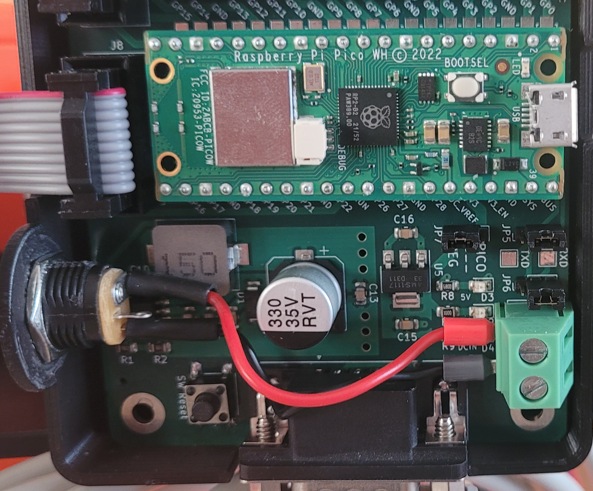

# @dirtbit contribution

* Display Assy + required Trickler Adapter Plate
* Pico Expansion Board enclosure + required OpenTrickler_RearBody
* Volume Reduction Inserts for easy cleaning

Instructions:
* You need a handful of M3x 10 / 12 / 16 / 20 hex screws and M3 nuts to screw things together. 
* The display I use is called "Mellow FLY Mini V 1.0 12864 Display"
* For using the enclosure, you need to turn the screw terminal on the expansion board by 180° and require a socket with M12 thread -> see 

Print with support on build plate only, with following orientations:
![render][./print_orientation.png]
![render][./print_orientation2.png]

Have fun.