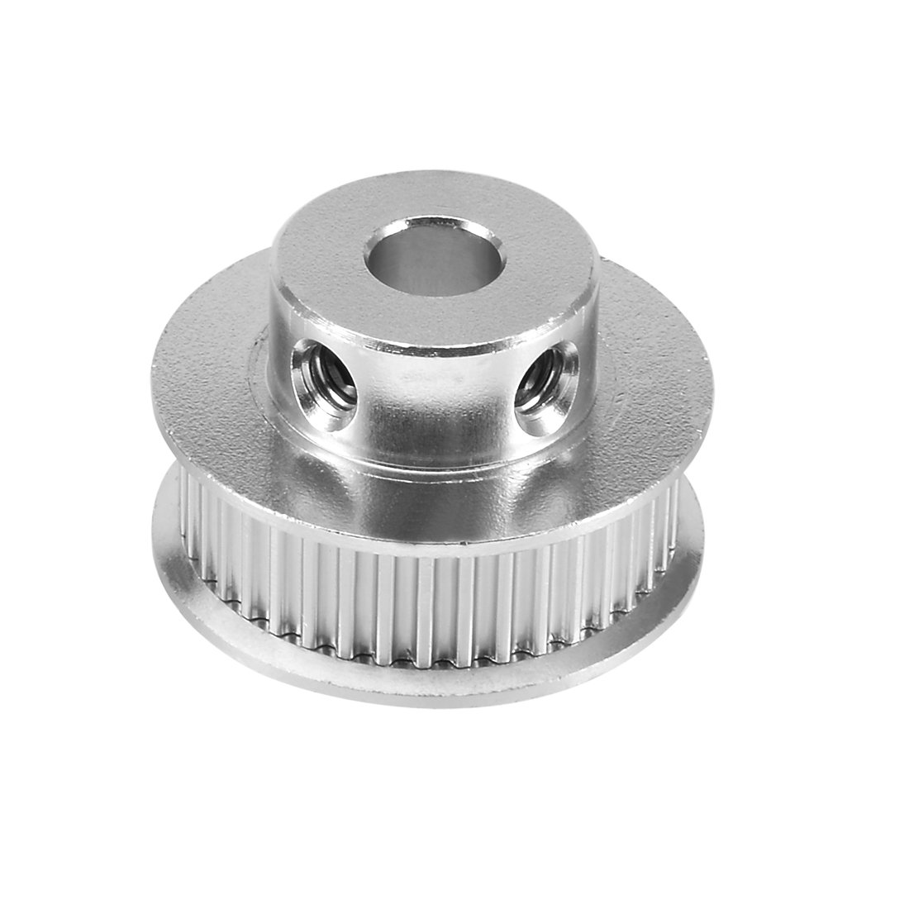

# Sourcing Guide
This document provides information regarding the self sourcing guide for aftermarket parts. 

✅ indicates parts that are verified to be compatible with the OpenTrickler system. 

## Stepper Motor Driver

Subject to the implementation of [Motor Expansion Board](https://github.com/eamars/RaspberryPi-Pico-Motor-Expansion-Board), TMC2209 from certain manufacturers are recommended. 

*Please note there is no standard pin out for TMC2209 StepStick modules therefore please stick to the recommended parts.*

* ✅ Fly TMC2209 [https://www.aliexpress.com/item/1005001877899893.html](https://www.aliexpress.com/item/1005001877899893.html)
*  ✅ BigTreeTech TMC2209 [https://www.aliexpress.com/item/33029587820.html](https://www.aliexpress.com/item/33029587820.html)

## Mini 12864 Display with Controller

Subject to the implementation of [Motor Expansion Board](https://github.com/eamars/RaspberryPi-Pico-Motor-Expansion-Board), The mini 1286 display from certain manufactorers are recommended.

*Please note there is no standard pin out for mini 12864 displays therefore please stick to the recommended parts.*

* ✅ Fly mini 12864 [https://www.aliexpress.com/item/1005003579276633.html](https://www.aliexpress.com/item/1005003579276633.html)
* ✅ BigTreeTech mini 12864 [https://www.aliexpress.com/item/1005005114662084.html](https://www.aliexpress.com/item/1005005114662084.html)

## Bearings
### 608-2RS or 608ZZ

You can find the bearing from [https://www.aliexpress.com/item/4000120401871.html](https://www.aliexpress.com/item/4000120401871.html)

✅ Select 608ZZ 8x22x7mm OR 608-2RS 8x22x7mm. 

*"In summary, the primary difference between "608ZZ" and "608-2RS" lies in the type of sealing or shielding they have. "608ZZ" has metal shields on both sides, while "608-2RS" has rubber seals on both sides."* - by ChatGPT

### 6804-2RS or 6804ZZ

You can find the bearing from [https://www.aliexpress.com/item/4000120762936.html](https://www.aliexpress.com/item/4000120762936.html)

✅ Select 6804-2RS 20x32x7mm 

## Motors

Any bipolar NEMA17 (42mm) stepper motor will work. The only thing you need to worry about is the output shaft. The output shaft need to be 5mm in diameter and longer than 20mm measured from the surface. 

* Hanpose 42x24mm [https://www.aliexpress.com/item/1005005195056354.html](https://www.aliexpress.com/item/1005005195056354.html)

## GT2 Belts
Both belts can be 3d printed. However if you're not feeling good to print those in TPU, you can also buy the aftermarket part. 

*The aftermarket close loop belts needs to be 1 teeth longer than the printed belt for easy to install purpose.*

### Coarse Trickler Tube Belt
[https://www.aliexpress.com/item/1005003420172630.html](https://www.aliexpress.com/item/1005003420172630.html)

* 174mm (87 teeth). 

### Fine Trickler Tube Belt
[https://www.aliexpress.com/item/1005003420172630.html](https://www.aliexpress.com/item/1005003420172630.html)

* 166 mm (83 teeth)

## 40 Teeth GT2 Timing Pulley

Both pulleys can be 3d printed. However if you're not feeling good to print those yourself, you can find the aftermarket parts. Below are example parts. 

* 5mm bore, for belt width 6mm [https://www.aliexpress.com/item/1005002843440540.html](https://www.aliexpress.com/item/1005002843440540.html)

