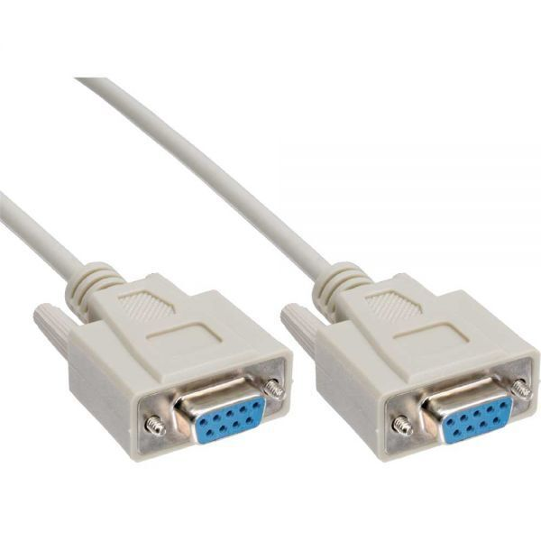
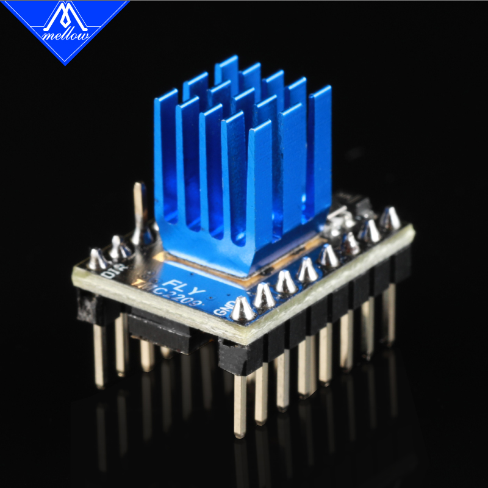
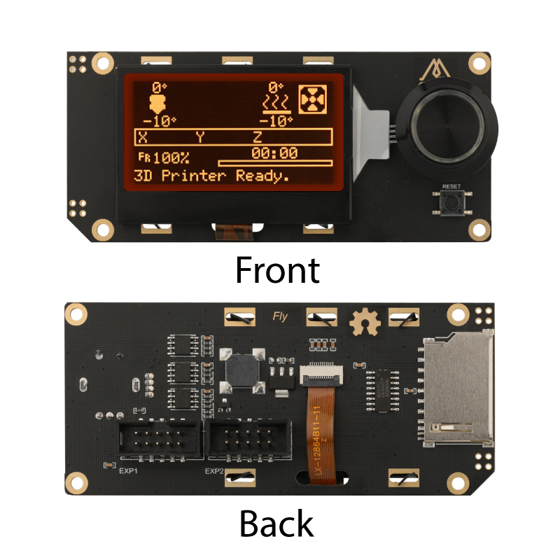
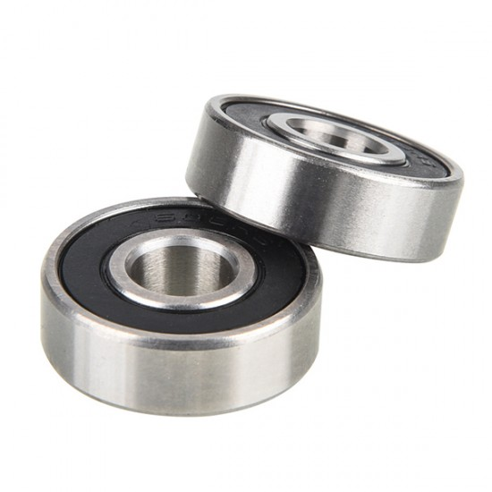
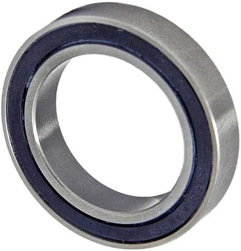
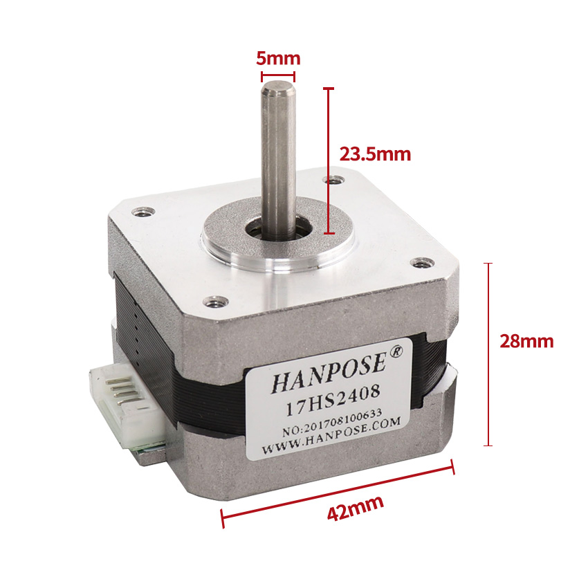
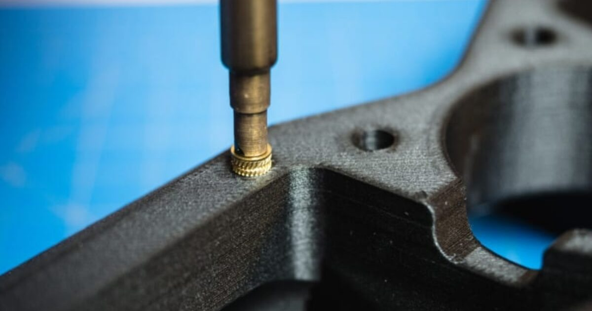
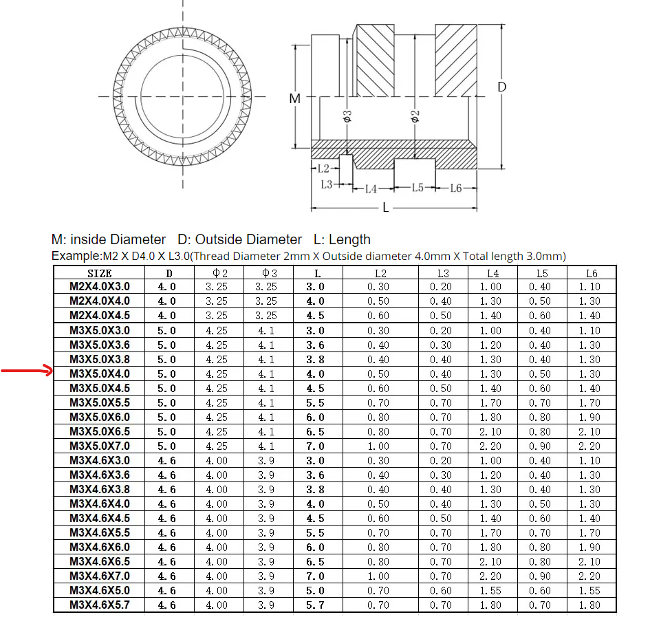
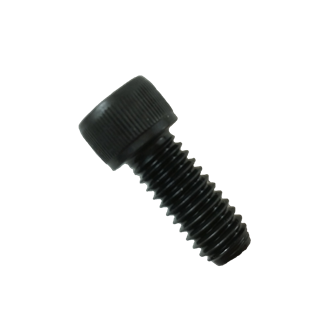
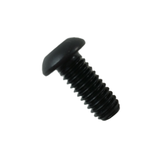

# Sourcing Guide

This document provides information regarding the self sourcing guide for aftermarket parts. 

✅ indicates parts that are verified to be compatible with the OpenTrickler system. 

## Things for OpenTrickler Controller

You could find details for Pico Motor Expansion Board from the [repository}(https://github.com/eamars/RaspberryPi-Pico-Motor-Expansion-Board).

### 12/24V Power Supply

You can use either 12V or 24V power supply. It is recommended to have minimum 2A output capacity to avoid any potential brown out when the motors draw too much current. Belows are recommended power supplys. 

* [Meanwell LRS-50-24 from Digikey](https://www.digikey.co.nz/en/products/detail/mean-well-usa-inc/LRS-50-24/7705048)

### 2mm Pitch Female Jumper

You will need 3x 2mm pitch female jumper per board. 

* [Aliexpress](https://www.aliexpress.com/item/3256803974952256.html)
* [RS-Online](https://nz.rs-online.com/web/p/jumpers-shunts/6742404)

### Raspbery Pi Pico W

The Pico W (with wireless) can be purchased according to the [Rasperry Pi offial site](https://www.raspberrypi.com/products/raspberry-pi-pico/?variant=raspberry-pi-pico-w). 

You can choose with or without the GPIO headers. If no GPIO header version is selected then you need to source and solder the 2x 40 single row 2.54mm pitch header yourself. 

#### 2.54mm pitch header for Pico W

You can buy single row of 40 pin header and cut into 2x 20 pin header yourself. Below are recommended sources. 

* ✅[LCSC](https://www.lcsc.com/product-detail/_ZHOURI-_C2977586.html)
* [Aliexpress](https://www.aliexpress.com/item/3256805561549792.html)

Additional 3 pin header can be soldered to the front of the Pico W to pair with [PicoProbe](https://github.com/raspberrypi/picoprobe) for advanced debugging/developing purpose.

#### MicroUSB cable for Pico W

Any MicroUSB data cable can be used to program the Pico W firmware. Those cable were commonly used for last generation of cell phones. Below are example parts. 

* [Aliexpress](https://www.aliexpress.com/item/3256805656009583.html)

### RS232 Cable (with DB9 header)

You will need a **female to female** DB9 cable to interface with A&D FX-120i/300i series of scale. You can use either straight-through or NULL-modem cable. Subject to the type of the cable you will need to insert the [2mm pitch jumper](#2mm Pitch Female Jumper) accordingly. Below are example parts. 

* [Aliexpress](https://www.aliexpress.com/item/3256805572553474.html)
* [Aliexpress](https://www.aliexpress.com/item/3256805240818006.html)

### Stepper Motor Driver

You will need two TMC 2209 stepper driver per board. 

Subject to the specific assumption of the StepStick wiring, the TMC2209 module from certain manufacturers are recommended. 

*Please note there is no standard pin out for TMC2209 StepStick modules therefore please stick to the recommended parts.*

* ✅ Fly TMC2209 [https://www.aliexpress.com/item/1005001877899893.html](https://www.aliexpress.com/item/1005001877899893.html)
* ✅ BigTreeTech TMC2209 [https://www.aliexpress.com/item/33029587820.html](https://www.aliexpress.com/item/33029587820.html)

### Mini 12864 Display with Controller

Subject to the implementation of [Motor Expansion Board](https://github.com/eamars/RaspberryPi-Pico-Motor-Expansion-Board), The mini 1286 display from certain manufactorers are recommended.

*Please note there is no standard pin out for mini 12864 displays therefore please stick to the recommended parts.*

* ✅ Fly mini 12864 [https://www.aliexpress.com/item/1005003579276633.html](https://www.aliexpress.com/item/1005003579276633.html)
* ✅ BigTreeTech mini 12864 [https://www.aliexpress.com/item/1005005114662084.html](https://www.aliexpress.com/item/1005005114662084.html)

## Things for OpenTrickler Hardware Assembly

### Bearings

#### 608-2RS or 608ZZ

You can find the bearing from [https://www.aliexpress.com/item/4000120401871.html](https://www.aliexpress.com/item/4000120401871.html)

✅ Select 608ZZ 8x22x7mm OR 608-2RS 8x22x7mm. 

*"In summary, the primary difference between "608ZZ" and "608-2RS" lies in the type of sealing or shielding they have. "608ZZ" has metal shields on both sides, while "608-2RS" has rubber seals on both sides."* - by ChatGPT

You will need 2x 608 bearing per OpenTrickler Assembly.

#### 6804-2RS or 6804ZZ

You can find the bearing from [https://www.aliexpress.com/item/4000120762936.html](https://www.aliexpress.com/item/4000120762936.html)

✅ Select 6804-2RS 20x32x7mm 

You will need 2x 6804 bearing per OpenTrickler Assembly.

### Nema 17 Stepper Motors

Any bipolar NEMA17 (42mm) stepper motor will work. The only thing you need to worry about is the output shaft. The output shaft need to be 5mm in diameter and longer than 20mm measured from the surface. 

* Hanpose 42x24mm [https://www.aliexpress.com/item/1005005195056354.html](https://www.aliexpress.com/item/1005005195056354.html)

You will need 2x stepper motors per OpenTrickler Assembly.

### GT2 Belts

Both belts can be 3d printed. However if you're not feeling good to print those in TPU, you can also buy the aftermarket part. 

*The aftermarket close loop belts needs to be 1 teeth longer than the printed belt for easy to install purpose.*

#### Coarse Trickler Tube Belt

[https://www.aliexpress.com/item/1005003420172630.html](https://www.aliexpress.com/item/1005003420172630.html)

* 174mm (87 teeth). 

#### Fine Trickler Tube Belt

[https://www.aliexpress.com/item/1005003420172630.html](https://www.aliexpress.com/item/1005003420172630.html)

* 166 mm (83 teeth)

### 40 Teeth GT2 Timing Pulley

Both pulleys can be 3d printed. However if you're not feeling good to print those yourself, you can find the aftermarket parts. Below are example parts. 

* 5mm bore, for belt width 6mm [https://www.aliexpress.com/item/1005002843440540.html](https://www.aliexpress.com/item/1005002843440540.html)

You will need 2x per OpenTrickler Assembly.

### Heatset Inserts

The heatset inserts with corresponding quantity can be found from the [assembly manual](assembly.md)

The dimension of the heatset inserts can be referenced as follow:

The heatset inserts (M3xD5xL4) are commonly used in the OpenTrickler assembly to join two plastic parts. Below are recommended parts

* ✅[Aliexpress](https://www.aliexpress.com/item/4000232858343.html)

### Assorted Screws

The screws with corresponding quantity can be found from the [assembly manual](assembly.md)

**Screws explained:** 
Socket Head Cap Screw (SHCS) The standard for socket cap screws. It features a cylindrical head with a recessed hex. It can be installed into a counter-bored hole or above the surface of the material.

Button Head Socket Cap Screw (BHCS) Features a domed head with a recessed hex. The head is wider and lower profile than a standard Socket Head Cap Screw.

