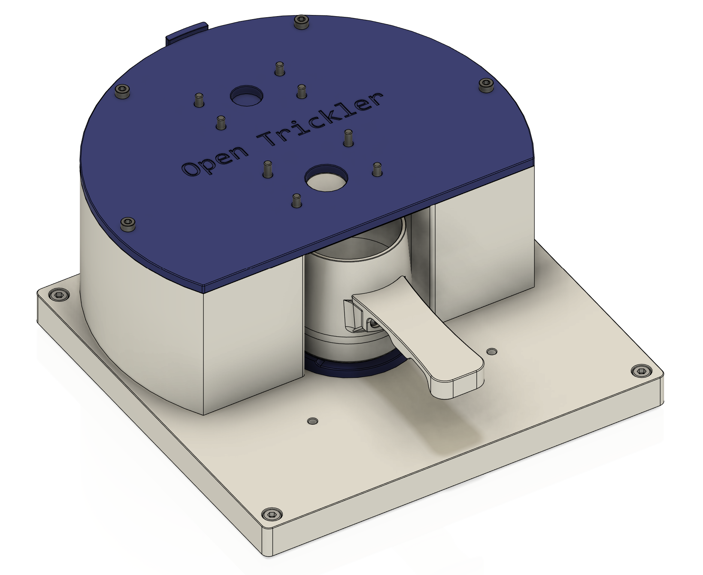

# G&G JJ223BF Shield Print and Assembly Guide

> :warning: **The G&G JJ BF series scales are evaluated not suitable for OpenTrickler application. Please hold off before purchase!**
> The G&G JJ BF series scales has inconsistent weight refresh rate at small weight changes. The evaluation suggested the scale may take up to 10 seconds to register a kernel drop, for which nullify the PID control algorithm adopted by the OpenTrickler firmware. 

