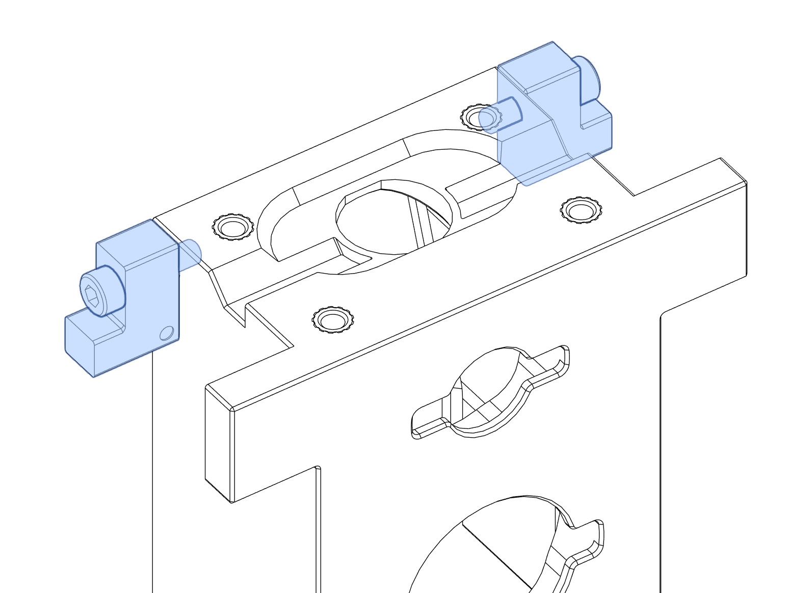
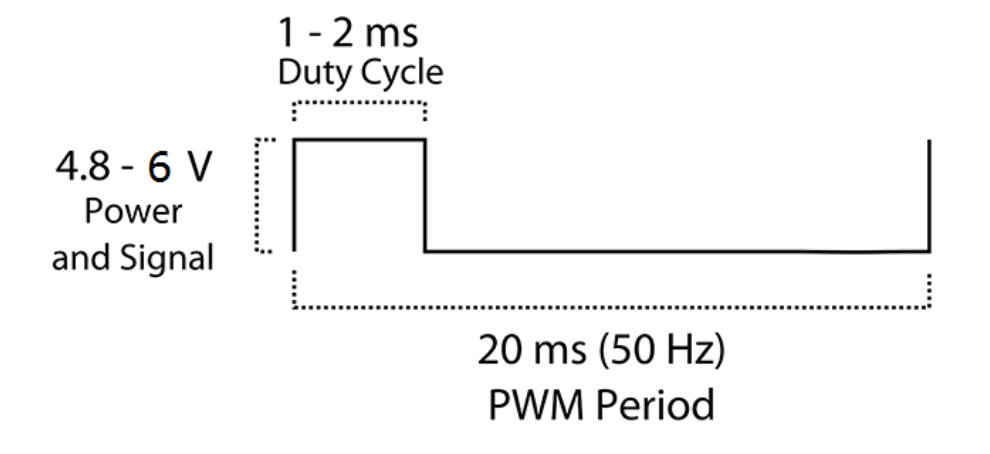

# OpenTrickler Front Body with Servo Gate Assembly Manual

## BOM

| Name                     | Quantity | Remarks                                                                                                                                      |
| ------------------------ | -------- | -------------------------------------------------------------------------------------------------------------------------------------------- |
| Heatset Inserts (M3x5x4) | 6        | The heatset inserts can be slightly longer. The longest recommended one is M3x5x5.5                                                          |
| M3x12 SHCS               | 2        |                                                                                                                                              |
| M2x8 self-tapping        | 4        | Each servo motor should come with 2x screw in the package                                                                                    |
| M2.5x3.5 BHCS            | 2        | Each servo motor should come with 1x screw in the package                                                                                    |
| TowerPro MG90s           | 2        | 180 deg servo motor is recommended. Other servo motors that have identical footprint than MG90s, for example, SG90, S0009M can also be used. |

## Tools

* 2.5mm hex driver

* Small phillips screwdriver

## Crimping

The [Pico Motor Expansion Board v2](https://github.com/eamars/RaspberryPi-Pico-Motor-Expansion-Board) assumes the servo motor comes with the JST PH2.54 connector. You may need to re-crimp the connector to 3pin JST PH 2.54 connectors in order to connect the servo motor to the motor expansion board. The colour code for MG90s servo motor is provided below. 

## Assembly Overview

## Component Prep

* front_body_with_shutter.stl

Melt 4x heatset inserts to the bottom of the front body then melt 2x heatset inserts to both side of the front body. Make sure the heatset inserts are sitting flush with the surface. 

## Assembly

Use 2x M3x12 SHCS to fix the left and right servo hangers to both sides. Servo hangers are polarised. A dot on the body is used to indicate the face pointing towards the servo motor. 

* left_servo_hanger.stl

* right_servo_hanger.stl

Slide the spur gears to the output gear of both servo motors. Make sure the side with the teeth is pushed against the gear. Use the M2.5x3.5 BHCS (came with the servo motor) to fix the spur gear in place. 

* spur_gear_x2.stl

Use 4x M2x8 self-tapping screw to fix the servo motor to the front body. Make sure the servo motors are installed so the spur gear is closer to the rear of the body. 

The assembly of the front body with servo gate is complete. In order to continue with the assembly, you need to tune the servo gate opening and closing duty cycle before the final assembly. 

## Tuning Guide

### Connect Servo Motors to the Controller Board.

* For Pico Motor Expansion Board v1 + PWM Expansion Board, you need to connect the left servo motor (from the front perspective) to J1, and the right servo motor to J2. 

* For Pico Motor Expansion Board v2, you need to connect the left servo motor (from the front perspective) to J6, and the right servo motor to J7. 

### Servo Motor Control Basics

The TowerPro MG90s uses PWM duty cycle to accept external command for position control. The period of the "on" cycle determines the absolute position shown in the table below. Intermediate positions between -90 to 90 degrees are linearly interpolated with respect to the duration of the "on" period.

The OpenTrickler uses the duty cycle (the ratio of the time between on and off per cycle) as the input to control the opening and closing of the servo gate.

| Period | Absolute Position | Duty Cycle (period/20ms) |
| ------ | ----------------- | ------------------------ |
| 1 ms   | -90 degree        | 0.050                    |
| 1.5 ms | 0 degree          | 0.075                    |
| 2 ms   | 90 degree         | 0.100                    |

The servo gate opening and closing duty cycle need to be tuned before the final assembly. Please follow the [initialization guide](https://github.com/eamars/OpenTrickler/blob/main/Manual/initialization_guide.md) to bring up the wireless controller. The following steps assumes the WebUI is functional. 

### Enable Servo Gate

The servo gate is disabled by default. You need to navigate to the WebUI -> Settings -> Servo Gate, toggle the "Servo Gate Enable" option from No to Yes, then hit the Apply button with "Save to EEPROM" option. Then restart the OpenTrickler controller by pressing the reset button, or reset from the WebUI. 

### Tune the Shutters

The left shutter is assigned to Shutter 0. By default the shutter is operating at a very limited range. You need to follow the below steps. 

1. Flip the front body up-side-down. 

2. Set the shutter 0 close duty cycle to 0.1, then apply the settings. 

3. Navigate to the Trickler page, click the Gate Close button. Wait for the servo motor to change position.

4. Place the left shutter to the bottom cut out at the closed position (demonstrated below). Make sure the left shutter engages with the spur gear. If not, adjust the shutter 0 close duty cycle up a bit (around 0.005) from the settings and click the Gate Close button again. 
   

5. Click Gate Open Button, wait for the servo motor to change position. 

6. The shutter is now moved to the open position. If the shutter is not fully closed, you need to adjust the shutter 0 open duty cycle up, then click the Gate Open Button. This process may need to be repeated multiple times until the full open duty cycle is termined by experiment. 

7. Repeat above procedures with the shutter 1. Note the shutter 1 is operating at the opposite position, where the open and close duty cycle is roughly opposite to the shutter 0. 

8. **(Important)** make sure the settings are saved in the end, by "Save to EEPROM". 

Once the shutter open and close angles are tuned, you can continue with the full body assembly. 
