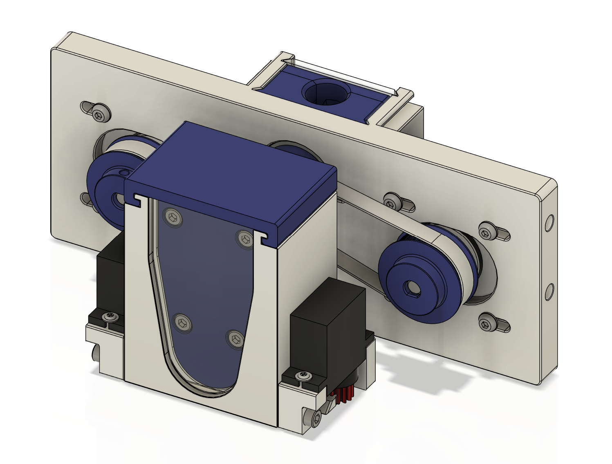

# OpenTrickler Print and Assembly Manual

## Print Guide

| Filename                                                 | Quantity | Alternative                                                                                                                                            | Remarks                                                                                                                                                               |
| -------------------------------------------------------- | -------- | ------------------------------------------------------------------------------------------------------------------------------------------------------ | --------------------------------------------------------------------------------------------------------------------------------------------------------------------- |
| [40_teeth_gt2_pulley_x2.stl](40_teeth_gt2_pulley_x2.stl) | 2        |                                                                                                                                                        | Can be substituted with aftermarket metal 40T pulley.                                                                                                                 |
| [bearing_cover_x2.stl](bearing_cover_x2.stl)             | 2        | Option 1: [bearing_cover_tighter_tolerance_x2.stl](Optional/bearing_cover_tighter_tolerance_x2.stl), Option 2: [VolumnReducer](Optional/VolumnReducer) | Option 1: 0.5mm tolerance for both trickler tube instead of 1mm. Option 2: See description from the VolumReducer. Both will lock the bearings in the bearing pockets. |
| [front_body.stl](front_body.stl)                         | 1        | [ServoGate](Optional/ServoGate)                                                                                                                        | See description from the ServoGate.                                                                                                                                   |
| [front_body_cover.stl](front_body_cover.stl)             | 1        |                                                                                                                                                        |                                                                                                                                                                       |
| [front_rear_door_x2.stl](front_rear_door_x2.stl)         | 2        |                                                                                                                                                        | Recommended to print in translucent material.                                                                                                                         |
| [GT2_82T_Belt.stl](GT2_82T_Belt.stl)                     | 1        |                                                                                                                                                        | Can be substituted with aftermarket 83T (166 mm) GT2 belt. This part has to be printed in TPU or any flexible material.                                               |
| [GT2_86T_Belt.stl](GT2_86T_Belt.stl)                     | 1        |                                                                                                                                                        | Can be substituted with aftermarket 87T (174 mm) GT2 belt. This part has to be printed in TPU or any flexible material.                                               |
| [large_rotary_tube.stl](large_rotary_tube.stl)           | 1        |                                                                                                                                                        | Recommended to print with random Z seam position.                                                                                                                     |
| [rear_body.stl](rear_body.stl)                           | 1        |                                                                                                                                                        |                                                                                                                                                                       |
| [small_rotary_tube.stl](small_rotary_tube.stl)           | 1        |                                                                                                                                                        | Recommended to print with random Z seam position.                                                                                         |

