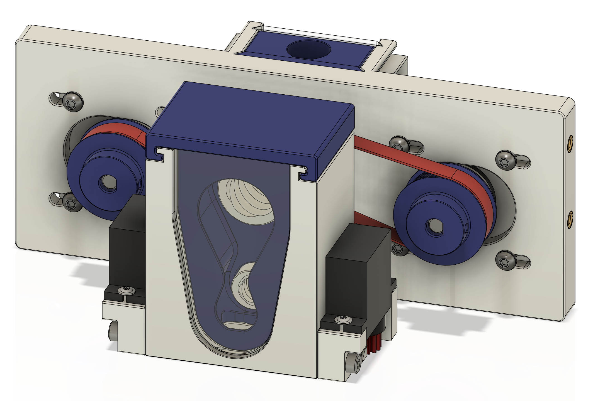
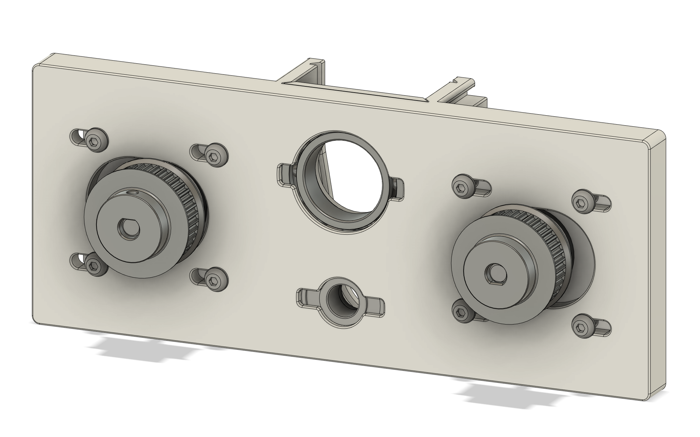
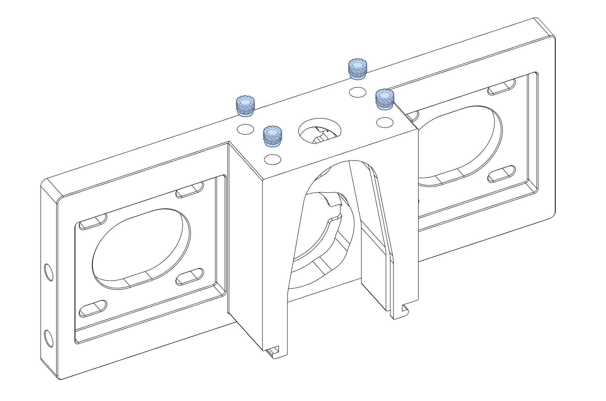
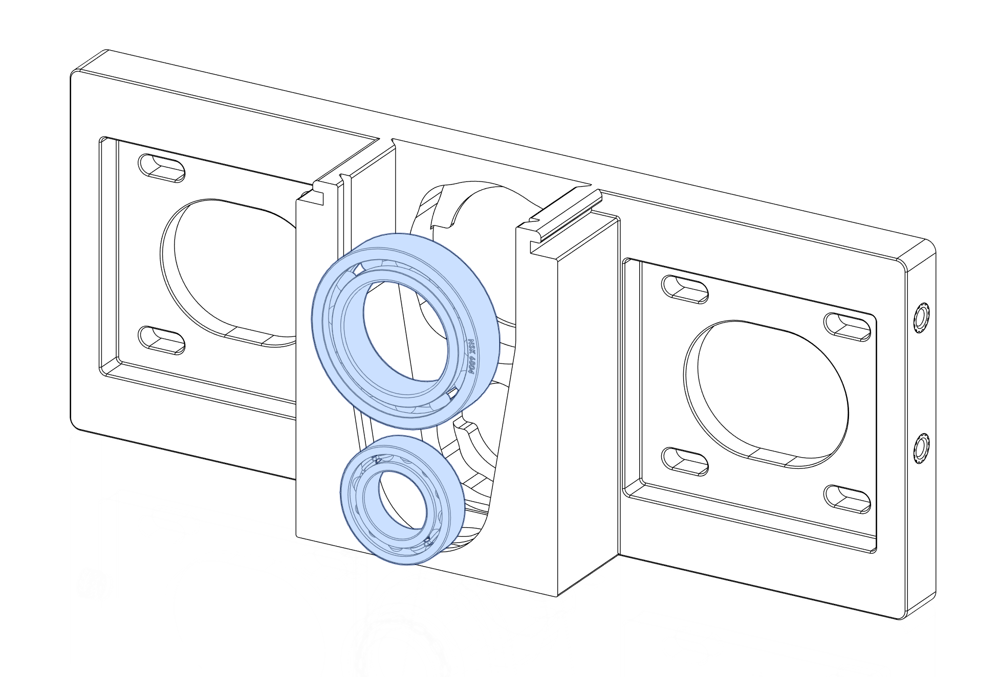
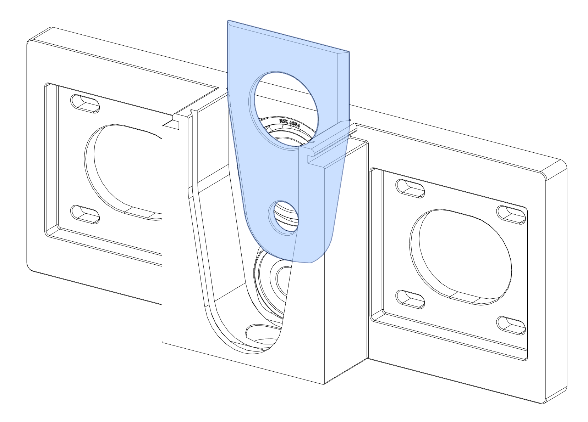

# OpenTrickler Print and Assembly Manual

## Printed Guide

| Filename                                                 | Quantity | Alternative                                                                                                                                              | Remarks                                                                                                                                                                   |
| -------------------------------------------------------- | -------- | -------------------------------------------------------------------------------------------------------------------------------------------------------- | ------------------------------------------------------------------------------------------------------------------------------------------------------------------------- |
| [40_teeth_gt2_pulley_x2.stl](40_teeth_gt2_pulley_x2.stl) | 2        |                                                                                                                                                          | Can be substituted with aftermarket metal 40T pulley.                                                                                                                     |
| [bearing_cover_x2.stl](bearing_cover_x2.stl)             | 2        | Option 1: [bearing_cover_tighter_tolerance_x2.stl](Optional/bearing_cover_tighter_tolerance_x2.stl) Option 2: [VolumnReducer](Optional/VolumnReducer) | Option 1: 0.5mm tolerance for both trickler tube instead of 1mm.  Option 2: See description from the VolumReducer. Both will lock the bearings in the bearing pockets. |
| [front_body.stl](front_body.stl)                         | 1        | [ServoGate](Optional/ServoGate)                                                                                                                          | The optional servo gate allows the charge port to be shutted when the cup is removed. This enables powder to be pre-charged before the trickling process.                 |
| [front_body_cover.stl](front_body_cover.stl)             | 1        |                                                                                                                                                          |                                                                                                                                                                           |
| [front_rear_door_x2.stl](front_rear_door_x2.stl)         | 2        |                                                                                                                                                          | Recommended to print in translucent material.                                                                                                                             |
| [GT2_82T_Belt.stl](GT2_82T_Belt.stl)                     | 1        |                                                                                                                                                          | Can be substituted with aftermarket 83T (166 mm) GT2 belt. This part has to be printed in TPU or any flexible material.                                                   |
| [GT2_86T_Belt.stl](GT2_86T_Belt.stl)                     | 1        |                                                                                                                                                          | Can be substituted with aftermarket 87T (174 mm) GT2 belt. This part has to be printed in TPU or any flexible material.                                                   |
| [large_rotary_tube.stl](large_rotary_tube.stl)           | 1        |                                                                                                                                                          | Recommended to print with random Z seam position.                                                                                                                         |
| [rear_body.stl](rear_body.stl)                           | 1        |                                                                                                                                                          |                                                                                                                                                                           |
| [small_rotary_tube.stl](small_rotary_tube.stl)           | 1        |                                                                                                                                                          | Recommended to print with random Z seam position.                                                                                                                         |

## BOM

| **Name**               | **Quantity** | **Remarks** |
| ---------------------- |:------------:|:-----------:|
| Heatset Inserts M3x5x4 | 12           |             |
|                        |              |             |
|                        |              |             |
|                        |              |             |
|                        |              |             |
|                        |              |             |
|                        |              |             |
|                        |              |             |
|                        |              |             |
|                        |              |             |

## Tools

* 2.5 mm hex driver

* 2.0 mm hex driver

## Assembly of Rear Body

### Component Prep

* [rear_body.stl](rear_body.stl)

Melt 4x heatset inserts to the bottom of the rear body. Make sure the heatset inserts are sitting flush with the surface.

### Assembly

Press 6804-2RS bearing to the top cut out and 608-2RS to the bottom cut out. [Printable bearing insert helpers](Tools) are supplied to use with benchtop vise if the bearings can't be pressed in by hands. 

For the next step, you have three options

1. [bearing_cover_x2.stl](bearing_cover_x2.stl): Slide the bearing cover to the rear cut out. The cover should sit flush with the top of the rear body, while two bearings are still free to rotate without resistance.
   If you can feel the abnormal resistance after installing the bearing cover, press the bearings inwards for additional 0.1mm to clear the interference.
   

2. [bearing_cover_tighter_tolerance_x2.stl](Optional/bearing_cover_tighter_tolerance_x2.stl): The procedure is identical to option 1 but with the bearing cover with slightly tigher tolerance. 

3. [VolumnReducer](Optional/VolumnReducer): Slide the bearing cover to the rear cut out. The cover should sit flush with the top of the rear body, while two bearings are still free to rotate without resistance.
   
