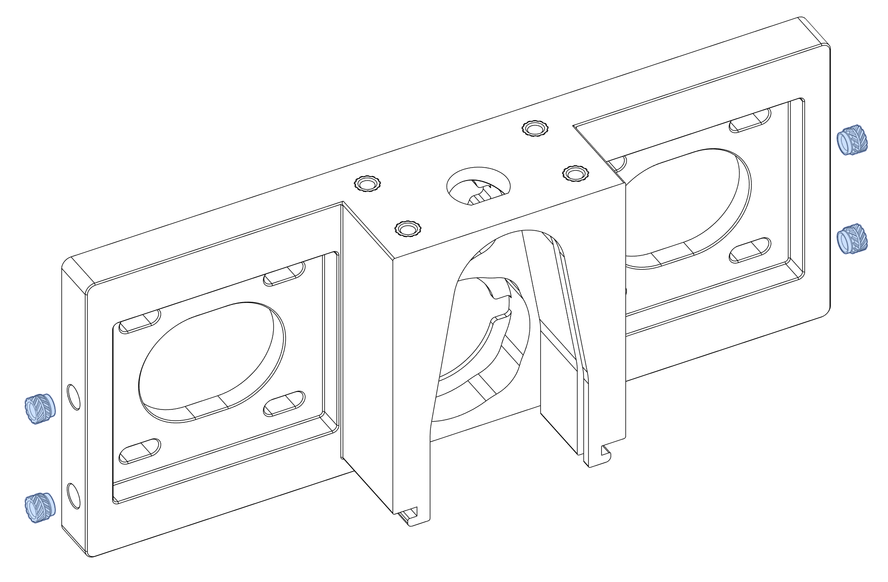
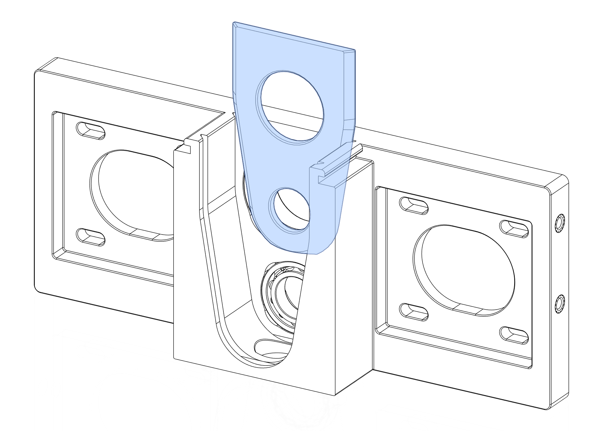
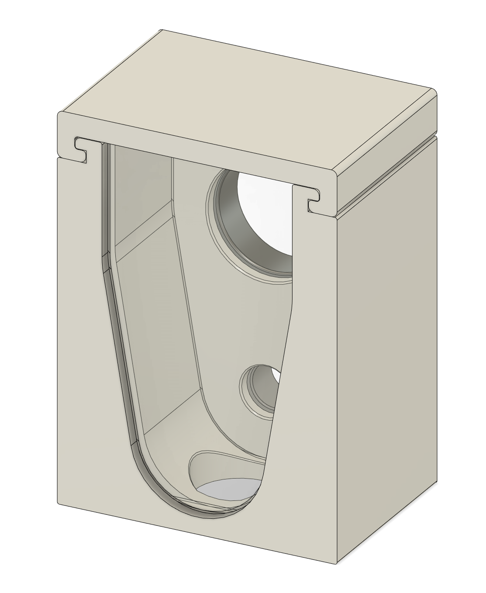
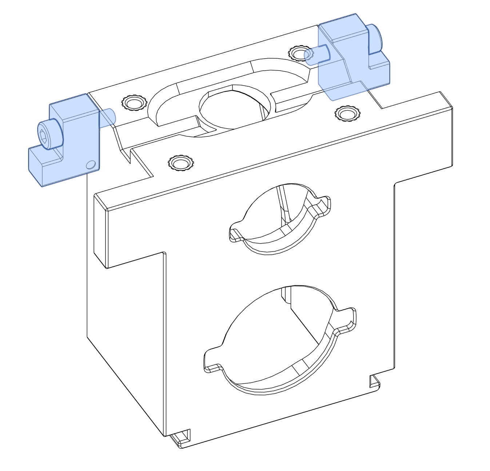
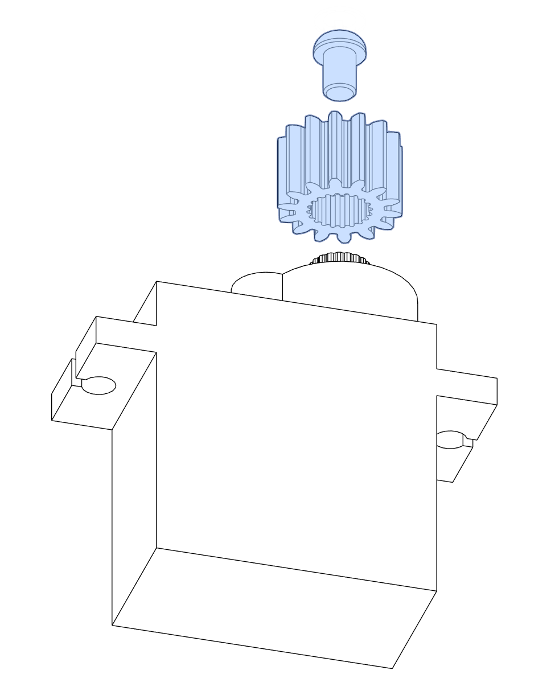
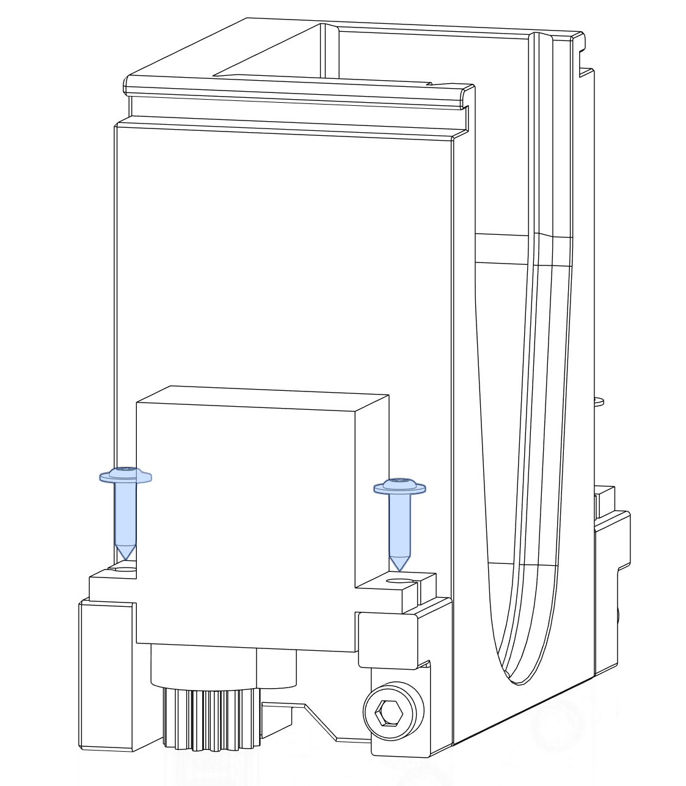

# OpenTrickler Print and Assembly Guide

## Print Guide

### Main Body

| Filename                                                 | Quantity | Alternative                                                              | Remarks                                                                                                                                                                                                                                                         |
| -------------------------------------------------------- | -------- | ------------------------------------------------------------------------ | --------------------------------------------------------------------------------------------------------------------------------------------------------------------------------------------------------------------------------------------------------------- |
| [40_teeth_gt2_pulley_x2.stl](40_teeth_gt2_pulley_x2.stl) | 2        |                                                                          | Can be substituted with aftermarket metal 40T pulley.                                                                                                                                                                                                           |
| [front_body.stl](front_body.stl)                         | 1        |                                                                          | The front body of the OpenTrickler.                                                                                                                                                                                                                             |
| [front_body_cover.stl](front_body_cover.stl)             | 1        |                                                                          | The top cover that sits on top of the front body.                                                                                                                                                                                                               |
| [front_rear_door_x2.stl](front_rear_door_x2.stl)         | 2        |                                                                          | Recommended to print in translucent material.                                                                                                                                                                                                                   |
| [GT2_82T_Belt.stl](GT2_82T_Belt.stl)                     | 1        |                                                                          | (Optional Printable Part) Can be substituted with aftermarket 83T (166 mm) GT2 belt. This part has to be printed in TPU or any flexible material.                                                                                                               |
| [GT2_86T_Belt.stl](GT2_86T_Belt.stl)                     | 1        |                                                                          | (Optional Printable Part) Can be substituted with aftermarket 87T (174 mm) GT2 belt. This part has to be printed in TPU or any flexible material.                                                                                                               |
| [large_rotary_tube.stl](large_rotary_tube.stl)           | 1        |                                                                          | Recommended to print with random Z seam position.                                                                                                                                                                                                               |
| [rear_body.stl](rear_body.stl)                           | 1        |                                                                          | The rear body of the OpenTrickler                                                                                                                                                                                                                               |
| [small_rotary_tube.stl](small_rotary_tube.stl)           | 1        | [small_rotary_tube_flow_through.stl](small_rotary_tube_flow_through.stl) | Recommended to print with random Z seam position.  - The default design has blocked rear end, good for normal and generic flow application.   - The alternative design has flow through rear end, good for high flow application, e.g,. magnum charges. |

### Servo Gate

| Filename                                                             | Quantity | Alternative | Remarks                                                                                    |
| -------------------------------------------------------------------- | -------- | ----------- | ------------------------------------------------------------------------------------------ |
| [ServoGate/left_servo_hanger.stl](ServoGate/left_servo_hanger.stl)   | 1        |             | Left servo hanger (from the front perspective)                                             |
| [ServoGate/left_shutter.stl](ServoGate/left_shutter.stl)             | 1        |             | Left shutter underneath the front body (from the front perspective)                        |
| [ServoGate/right_servo_hanger.stl](ServoGate/right_servo_hanger.stl) | 1        |             | Right servo hanger (from the front perspective)                                            |
| [ServoGate/right_shutter.stl](ServoGate/right_shutter.stl)           | 1        |             | Right shutter underneath the front body (from the front perspective)                       |
| [ServoGate/spur_gear_x2.stl](ServoGate/spur_gear_x2.stl)             | 2        |             | Spur gear for both servo motors. Can be opted out if you're not planning to use servo gate |

### Volume Reducer

| Filename                                                                                                   | Quantity | Alternative | Remarks                        |
| ---------------------------------------------------------------------------------------------------------- | -------- | ----------- | ------------------------------ |
| [VolumeReducer/FrontVolumeReductionInsert_Bottom.stl](VolumeReducer/FrontVolumeReductionInsert_Bottom.stl) | 1        |             | Front volume reducer body      |
| [VolumeReducer/FrontVolumeReductionInsert_Top.stl](VolumeReducer/FrontVolumeReductionInsert_Top.stl)       | 1        |             | Serving as front bearing plate |
| [VolumeReducer/RearVolumeReductionInsert_Bottom.stl](VolumeReducer/RearVolumeReductionInsert_Bottom.stl)   | 1        |             | Rear volume reducer body       |
| [VolumeReducer/RearVolumeReductionInsert_Top.stl](VolumeReducer/RearVolumeReductionInsert_Top.stl)         | 1        |             | Serving as rear bearing plate  |

## BOM

| **Name**               | **Quantity** | **Remarks**                                                                                                                                  |
| ---------------------- |:------------ |:-------------------------------------------------------------------------------------------------------------------------------------------- |
| M2x8 self-tapping      | 4            | Each servo motor should come with 2x screw in the package                                                                                    |
| Heatset Inserts M3x5x4 | 18           |                                                                                                                                              |
| M2.5x3.5 BHCS          | 2            | Each servo motor should come with 1x screw in the package                                                                                    |
| M3x8 BHCS              | 8            |                                                                                                                                              |
| M3x12 SHCS             | 2            |                                                                                                                                              |
| Shim Washer            | 8            | OD=6mm, ID=3mm, Thick=0.5mm                                                                                                                  |
| 6804 Bearing           | 2            |                                                                                                                                              |
| 6801 Bearing           | 2            |                                                                                                                                              |
| Nema 17 Stepper Motor  | 2            | See the sourcing guide for recommendations                                                                                                   |
| TowerPro MG90s         | 2            | 180 deg servo motor is recommended. Other servo motors that have identical footprint than MG90s, for example, SG90, S0009M can also be used. |

## Tools

* 2.5 mm hex driver

* 2.0 mm hex driver

* Small phillips screwdriver

## Assembly of Rear Body

### Component Prep

Melt 4x heatset inserts to the bottom of the [rear_body.stl](rear_body.stl). Make sure the heatset inserts are sitting flush with the surface.

Optionally, the additional 4x heatset inserts can be melt to either sides of the body to support the installation of additional parts, for example, the [WeightHolder](Optional/WeightHolder). 

### Assembly

Press 6804 bearing to the top pocket and 6801 bearing to the bottom pocket of [rear_body.stl](rear_body.stl). [Printable bearing insert helpers](Tools) are supplied to use with benchtop vise if the bearings can't be pressed in by hands. 

Slide the [RearVolumeReductionInsert_Top.stl](VolumeReducer/RearVolumeReductionInsert_Top.stl) to the first cut out next to the bearings from the top, serving as the bearing cover. Ensure the part is sitting flush with the top surface. 

Push the [RearVolumeReductionInsert_Bottom.stl](VolumeReducer/RearVolumeReductionInsert_Bottom.stl) from the rear opening against the bearing cover. 

Then slide the [front_rear_door_x2.stl](front_rear_door_x2.stl) to the second cut out from the top, Ensure the part is sitting flush with the top surface.

Use 8x M3x8 BHCS screws with the optional M3 shim washers to mount two stepper motors onto the [rear_body.stl](rear_body.stl), but don't tighten them yet. Make sure the motor can slide left to right with little to none resistance.

Slide 2x [40_teeth_gt2_pulley_x2.stl](40_teeth_gt2_pulley_x2.stl) to the motor shaft but don't tighten the set screws yet. The pulley position will be adjusted in the later step.

The rear body assembly is now complete. 

## Assembly of Front Body

### Crimping

The [Pico Motor Expansion Board v2](https://github.com/eamars/RaspberryPi-Pico-Motor-Expansion-Board) assumes the servo motor comes with the JST PH2.54 connector. You may need to re-crimp the connector to 3pin JST PH 2.54 connectors in order to connect the servo motor to the motor expansion board. The colour code for MG90s servo motor is provided below.

### Component Prep

Melt 4x heatset inserts to the bottom of the [front_body.stl](front_body.stl) and 2x to either sides. Make sure the heatset inserts are sitting flush with the surface.

### Assembly

Use 2x M3x12 SHCS to fix the [left_servo_hanger.stl](ServoGate/left_servo_hanger.stl) and [right_servo_hanger.stl](ServoGate/right_servo_hanger.stl) to both sides. Servo hangers are polarised. A dot on the body is used to indicate the face pointing towards the servo motor.

Slide the [spur_gear_x2.stl](ServoGate/spur_gear_x2.stl) to the output gear of both servo motors. Make sure the side with the teeth is pushed against the gear. Use the M2.5x3.5 BHCS (came with the servo motor) to fix the spur gear in place.

Use 4x M2x8 self-tapping screw to fix the servo motors to the front body at both sides. Make sure the servo motors are installed so the spur gear is closer to the rear of the body.

Press 6804 bearing to the top bearing pocket and 608 to the bottom bearing pocket. [Printable bearing insert helpers](Tools) are supplied to use with benchtop vise if the bearings can't be pressed in by hands.

For the next step, you have three options

1. [bearing_cover_x2.stl](bearing_cover_x2.stl): Slide the bearing cover to the rear cut out. The cover should sit flush with the top of the rear body, while two bearings are still free to rotate without resistance.If you can feel the abnormal resistance after installing the bearing cover, press the bearings inwards for additional 0.1mm to clear the interference.
    

2. [bearing_cover_tighter_tolerance_x2.stl](Optional/bearing_cover_tighter_tolerance_x2.stl): The procedure is identical to option 1 but with the bearing cover with slightly tigher tolerance.

3. [VolumnReducer](Optional/VolumnReducer): Slide the front volumn reducer assembly to the rear cut out. The cover should sit flush with the top of the front body, while two bearings are still free to rotate without resistance.
    

Slide the [front_rear_door_x2.stl](front_rear_door_x2.stl) to the cut out, the front door should sit flush with the top of the [front_body.stl](front_body.stl).

Slide the [front_body_cover.stl](front_body_cover.stl) to the groove top of the [front_body.stl](front_body.stl) then the front body assembly is complete.

## Assembly of Open Trickler Front and Rear Body

### Assembly

Insert both [large_rotary_tube.stl](large_rotary_tube.stl) and [small_rotary_tube.stl](small_rotary_tube.stl) through the rear bearing. You may experience some resistance subject to the 
tolerance of the printed part. 

Slide the motor towards rotary tubes to the nearest position. Once done, slide the belt onto rotary tubes and pulleys. Make
sure the longer belt is connected to the motor on the right side. **Do not tension the belt, nor adjust the depth of the pulley for now.**

Slide the front body over the rotary tubes through bearings. You need to push the front body all the way in. 

The OpenTrickler is now assembled. In the later steps the OpenTrickler will be mounted to one of the scale adapter for final assembly.

## Post Installation Adjustments

Assuming you have already built the suitable scale shield and attached the OpenTrickler to it, you can finalize the installation by tensioning the belt. 

### Adjust Pulley Depth

Look through the unit from the left and right side, push or pull the pulley on the shaft to align the flange with the rotary tubes.

### Tension The Belt

You need to adjust the tension of the belt. First loosen 8x M3x8 BHCS used to secure stepper motors. 
Then pull motors slightly to tension the belts. Once done, tighten all 8 screws. 

# Congratulations

Your Open Trickler is now assembled!
