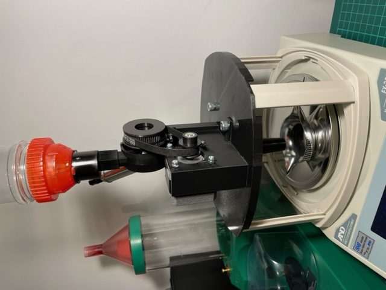
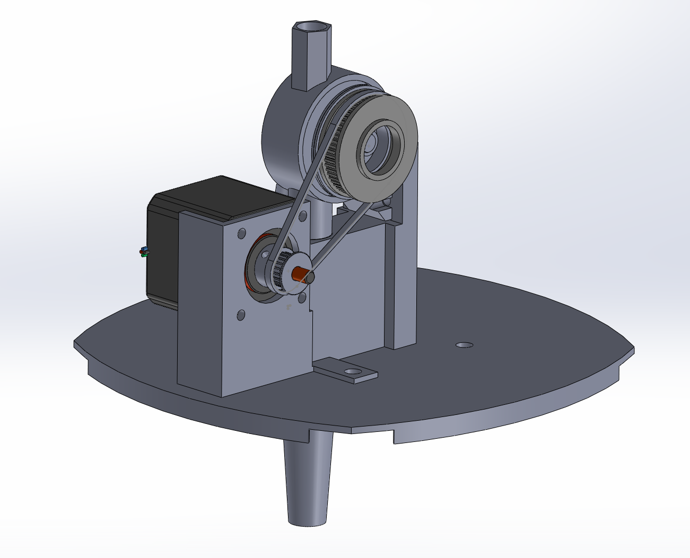

3D Printable OpenTrickler for A&D FX/FZ series scale
====================================================

Aftermarket component list
--------------------------
	- Lee Perfect Poweder Measure
	- NEMA17 stepper motor
	- L298N stepper motor driver
	- Hornady Vibotary Trickler
	- 24 Teeth GT2 pulley
	- Pulley belt (Length TBD)
	- NUCLEO Dev board
	- MAX3232 RS232 to TTL converter (brand TBD)
	- VN10KM N-channel Fet
	- Meanwell 12V power supply

Mounting Hardware Overview
---------------

