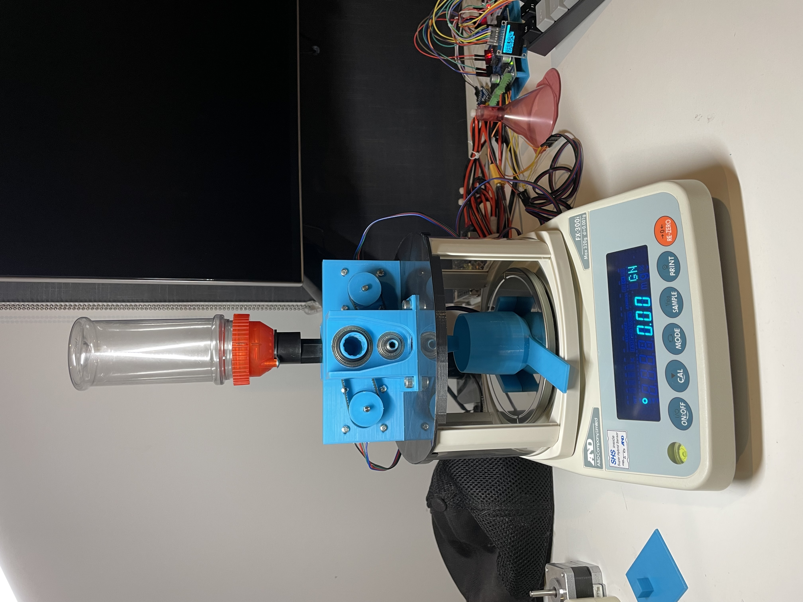
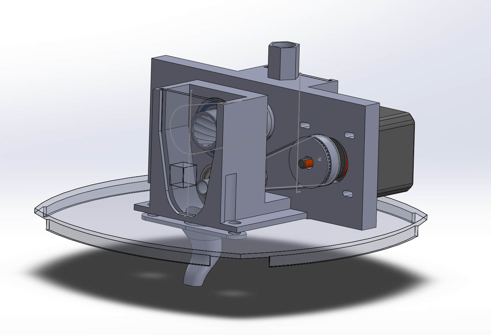

3D Printable OpenTrickler for A&D FX/FZ series scale
====================================================

Aftermarket component list
--------------------------
- Lee Perfect Powder Measure (Powder Hop)
- 2x NEMA17 Stepper Motor (Pancake model was used)
- [ST X-NUCLEO-IHM02A1](https://www.st.com/en/ecosystems/x-nucleo-ihm02a1.html) Stepper Motor Driver
- [ST Nucleo F446RE](https://os.mbed.com/platforms/ST-Nucleo-F446RE/) Dev Board
- 8x M3x8 screw
- MAX3232 RS232 to TTL converter
- 12V switch mode power supply
- [Duinotech 1.3 inch OLED display](https://www.jaycar.co.nz/duinotech-1-3-inch-monochrome-oled-display/p/XC3728)
- 4x4 Keypad

Mounting Hardware Overview
---------------

