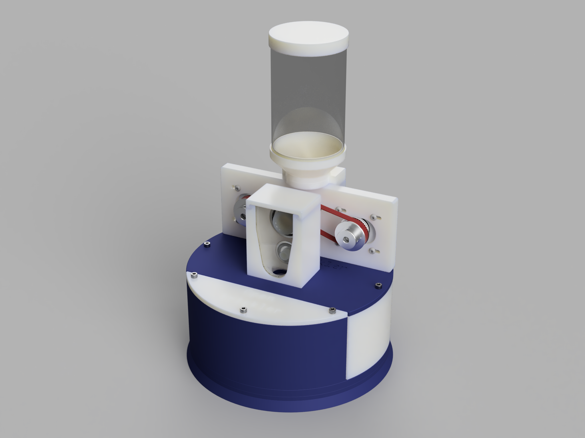
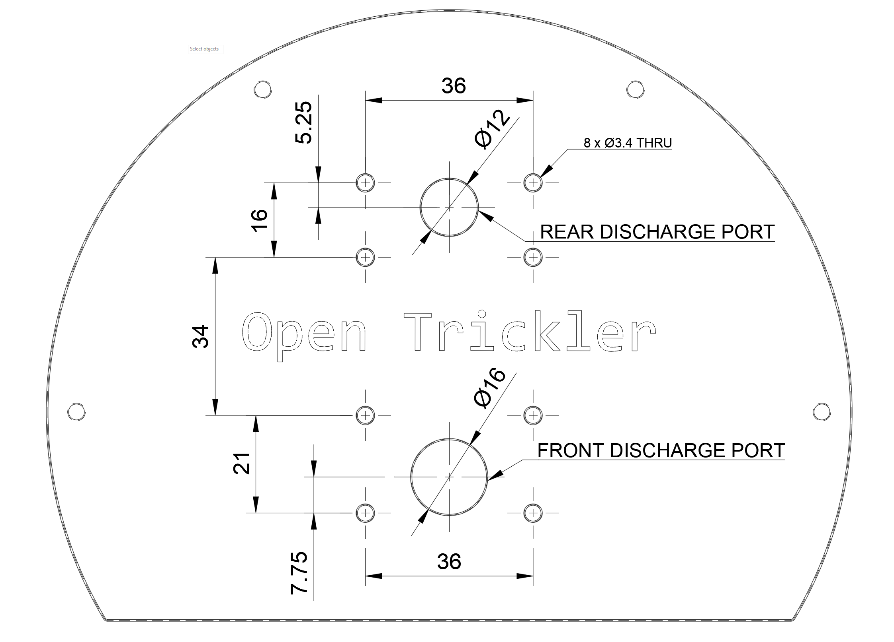

# Open Trickler - The Open Source Powder Trickler System

Inspired by the [AutoTrickler v4](https://autotrickler.com/pages/autotrickler-v4) and [Super Trickler](https://supertrickler.com.au/), the OpenTrickler is designed be printed and assembled using common tools to build Voron printers.

Join our [discord server](https://discord.gg/ZhdThA2vrW) for help and development information. 

# Documentations

* Bill of Material (BOM): [LINK](Manual/assembly.md#bom)
* Sourcing Guide: [LINK](Manual/sourcing_guide.md)
* Assembly Manual: [LINK](Manual/assembly.md)
* Initialization Guide: [LINK](Manual/initialization_guide.md)

Other supporting documents:

* Guide to order PCB from JLCPCB: [LINK](https://github.com/eamars/RaspberryPi-Pico-Motor-Expansion-Board/blob/main/production/README.md)
* A&D Scale Configuration Guide: [LINK](https://github.com/eamars/OpenTrickler-RP2040-Controller/blob/main/manuals/OpenTrickler%20manual%20for%20ADFX%20scale.pdf)
* OpenTrickler - Connect to Wireless: [LINK](https://github.com/eamars/OpenTrickler-RP2040-Controller/blob/main/manuals/connect_to_wireless.md)
* OpenTrickler - Update Firmware via USB: [LINK](https://github.com/eamars/OpenTrickler-RP2040-Controller/blob/main/manuals/firmware_update_via_usb.md)

# Print Guide

The printer need to be tuned at least for extruder e-stepts and flow as it has plastic to metal contact which requires certain tolerances. The Open Trickler can be printed in various materials.

* Main Material: ABS/PETG/PLA you name it.
* Belt: TPU 95A.
* 4x walls
* 5x tops and bottoms layers.
* 0.4~0.45mm line width
* 40% infill.

You should print provided STL with default orientation. **NO SUPPORT IS NEEDED FOR ALL PRINTED PARTS**.

# Controller

The Open Trickler Controller is split into following projects: 

* Custom PCB with Raspberry Pi Pico [Raspberry Pi Pico Motor Expansion Board](https://github.com/eamars/RaspberryPi-Pico-Motor-Expansion-Board)
* Firmware that utilises the Raspberry Pi RP2040 micro controller [OpenTrickler RP2040 Controller](https://github.com/eamars/OpenTrickler-RP2040-Controller)

# Interface Pattern

If you're a developer and would like to port the OpenTrickler to other platform/scale, you could use the mounting pattern as specified below. The interface is guaranteed to be consistent between minor revisions. 

